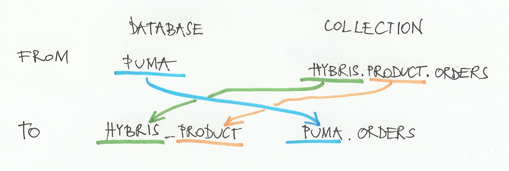

# mongodb-convert [](https://travis-ci.org/VOID404/MongoDB-convert) [](https://github.com/VOID404/MongoDB-convert/issues) [](https://nodejs.org/en/) [](https://www.mongodb.com/download-center?jmp=nav#community) [](https://raw.githubusercontent.com/VOID404/MongoDB-convert/master/LICENSE) []() 
Copies and transforms collections from all mongodb databases on given servers and upload them to another server.

## Instalation

Download node at [nodejs.org](https://nodejs.org/en/) and install it, if you haven't already.
```sh
npm install -g
```

# Usage

Configure it with [config.json](config.json), then launch it and
it will copy data from all databases from all servers in `sourceUrl` list to `targetUrl` like this: 

## Dependencies

- [JSON](http://json.org): Douglas Crockford&#x27;s json2.js
- [async](https://github.com/caolan/async#readme): Higher-order functions and common patterns for asynchronous code
- [mongodb](https://github.com/mongodb/node-mongodb-native): The official MongoDB driver for Node.js
- [synchronize](http://alexeypetrushin.github.com/synchronize): Turns asynchronous function into synchronous

## Dev Dependencies

- [chai](http://chaijs.com): BDD/TDD assertion library for node.js and the browser. Test framework agnostic.
- [chance](http://chancejs.com): Chance - Utility library to generate anything random
- [mocha](https://github.com/mochajs/mocha#readme): simple, flexible, fun test framework
- [readme-generator](https://github.com/void404/readme-generator#readme): Generates README.md based on handlebars template

## License

[GPL-3.0](LICENSE)

