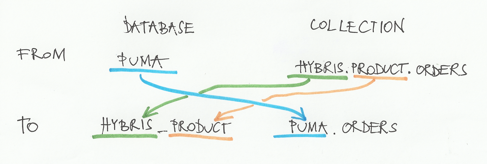

# {{name}} {{#each readMeGenerator.shields}}{{{this}}} {{/each}}
{{description}}

## Instalation

Download node at [nodejs.org](https://nodejs.org/en/) and install it, if you haven't already.
```sh
npm install -g
```

# Usage

Configure it with [config.json](config.json), then launch it and
it will copy data from all databases from all servers in `sourceUrl` list to `targetUrl` like this: 

{{#if dependencies}}
## Dependencies

{{#each dependencies}}
- [{{this.name}}]({{this.homepage}}): {{this.description}}
{{/each}}
{{/if}}

{{#if devDependencies}}
## Dev Dependencies

{{#each devDependencies}}
- [{{this.name}}]({{this.homepage}}): {{this.description}}
{{/each}}
{{/if}}

## License

{{#if readMeGenerator.licenseFile}}
[{{license}}]({{readMeGenerator.licenseFile}})
{{else}}
{{license}}
{{/if}}
